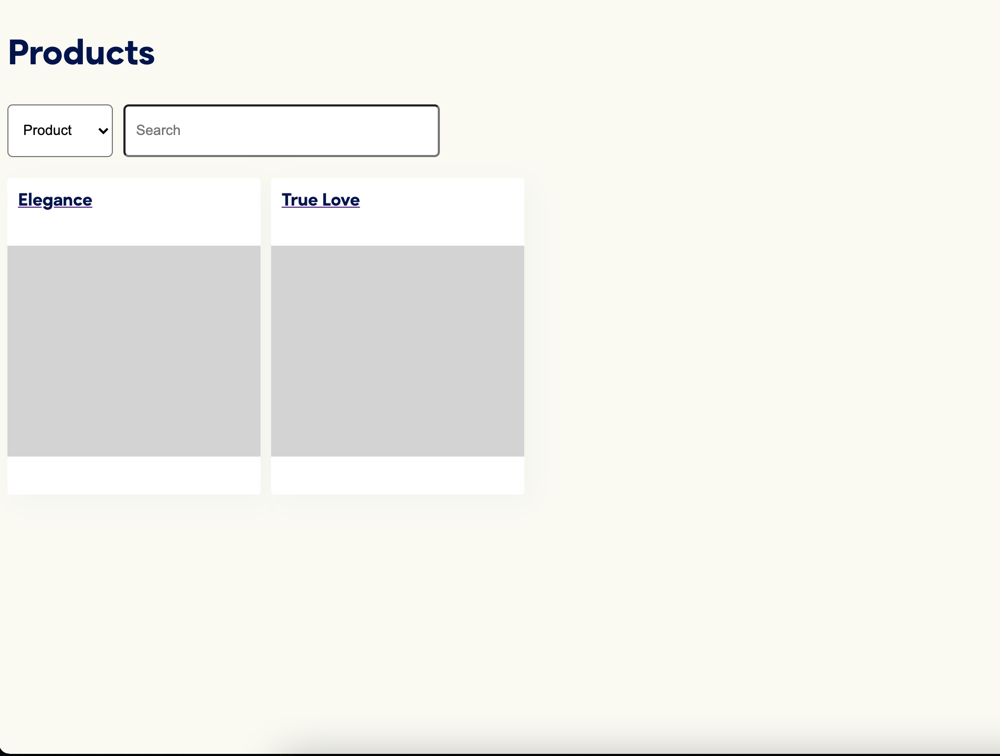
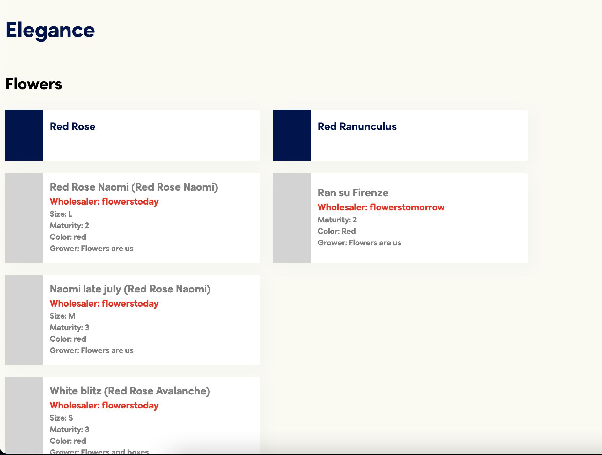

# Floom Technical Exercise Solution
Dear Richie and Ashley, thank you for the opportunity to solve this exercise.

### Overall Task

*This is how my Product page looks like.*

 

*And this is product details.*

 

*I have included Flower model into Product so I don't need to have additional request to retrieve flowers for a product.*

### Subtask 1 (data model design)
We don’t have an approach defined yet for storing additional flower attributes in our platform or our database, so you have freedom to decide how you want to implement this.

Whatever approach you take, it needs to be extensible to support additional attributes in the future (e.g. stem length, flower quality, etc.)

*Solution*

*I have extended flower model by migration, with sequelize it's fairly easy and allows to extend models as much as we would like. Sequelize also supports virtual fields, but in that case common migration would be just fine.*

### Subtask 2 (backend + frontend)
Implement a service that executes the following:
- Queries all of the wholesale sellers API's for any product data they have available,
- Store this data in the Data model you have designed
- Make this unified data available for querying by the frontend

You have the freedom to decide where you want to show the items being sold. For example, you can show it on the product detail page beside the current Flowers that compose the product.

*Solution*

*The `wholesalerService` invokes two providers for one wholesaler each. Each provider requests 3rd party endpoint and maps out results into SKU data model. Unfortunately I wasn't able to quickly fix association so that I can retrieve skus as property of each flower model, so I've created another endpoint that fetches SKUs based on flower name. Going forward that approach could be even more beneficial as it is easier to invalidate that data and request new one.*

### Bonus Items (implement only 1 of 2)
### Subtask 3
On the product list page, implement a search that shows all products that match a flower attribute (as a florist, I want to see how many of my products have Red Ranunculus in them).

*Solution*

*`SearchTypeSelect` component allows user to switch between searching either within product name or flower name.*

### Subtask 4
Extend the API to check for whether an item being sold is or isn’t in stock at a specific time and adjust your display to take this into account

*No solution, sorry*

## Designs
These are only for reference - you do not need to implement these high fidelity designs exactly as illustrated. Feel free to make changes to them or simplify them as you see fit to meet the time constraints of the exercise (the exercise aims to test your overall approach to solving the problem, not your ability to implement high fidelity designs specifically)

**Product List Page** - Images can be found in the media folder

**Product Detail Page** - Images can be found in the media folder

## Data + Endpoints

`npm install` will pull packages required to supply local mock api endpoints

`npm run apis` will run the local mock apis

`cd frontend && npm install && npm run start` will pull packages required to build the frontend project and run it in dev mode

`cd backend && npm install && npm run start`  will pull packages required to build the backend project and run it in dev mode

We have provided a **Product List** api endpoint that provides a list of products.

## Deliverables
- Constraints - Use React, Node, Typescript and an SQL database of your choice.
- Beyond that you're open to use any frameworks you wish. We'll discuss your choices in our follow up meeting.
- We have provided boiler-plating for the Frontend project as well as for the Api endpoints and data-models you are free to continue from these or roll your own base project structure.
- We don't wish for you to spend longer than two hours on this task. If you haven't time to complete all elements of the task that's fine, we can talk about them more in person.
- We will be evaluating primarily on the strength the implementation directly connected to the tasks listed, as opposed to rigging and boiler plating.
- When we look at your solution we will be mainly looking at your approach to understanding the task, code structure, code style, how you handle styling, your design awareness, how you handle logic and data. So be sure to show these factors in your solution.
